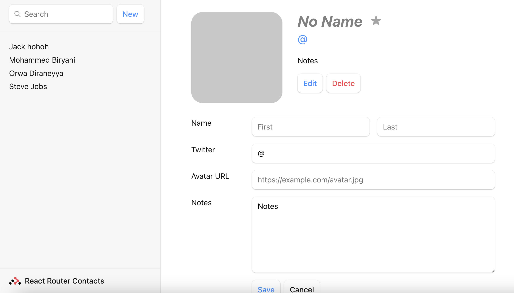
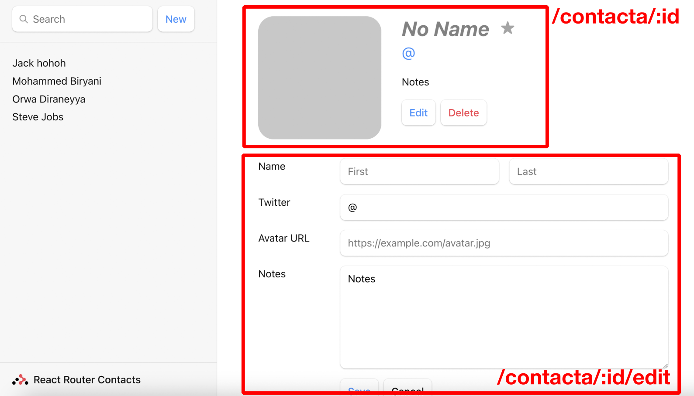

# React Router Workshop

In this workshop you, single-handedly, try to transform this messy page which you got from the designer team:

Into a routed frontend react application that has no functionality.

What do we mean? we simply want the parts below to only be visible when the corresponding routes are navigated to manually in the browser:

If this was easy for you, then here are more things you can do to move the application towards a fully functional app (which is a long process so approach it in baby steps):
1. Instead of showing an empty contact, show the contact with the corresponding `id` from the `contacts` array when navigated to the `/contacts/:id` route
2. When clicking edit, fill the fields with the values from the contact array depending on the `id` parameter in `/contacts/:id/edit`